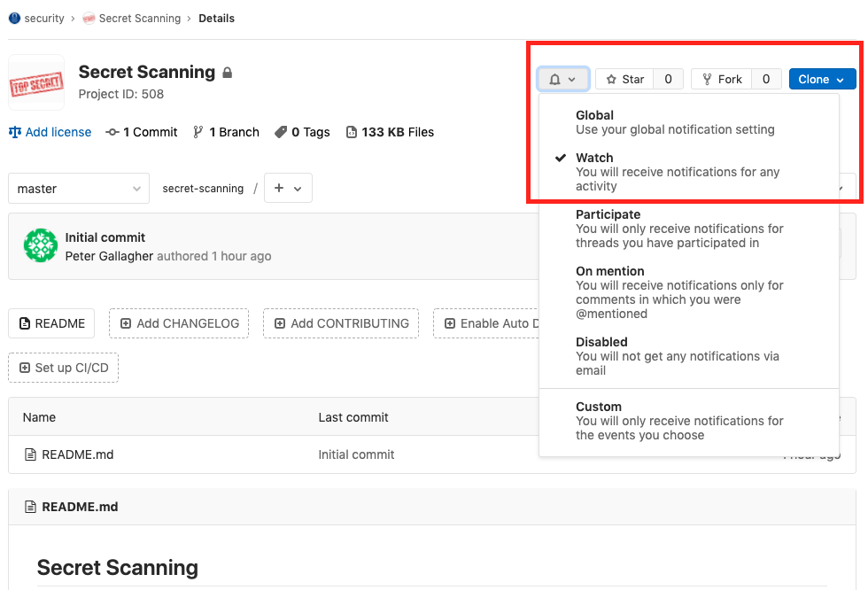

# Secret Scanning

Implementing secret scanning helps prevents you from committing passwords and other sensitive information to a git repository. This is a huge problem with people committing valuable secrets (e.g. AWS Access Keys, API keys, private keys etc.) to public repos (e.g. Github). Leaking credentials in this manner can lead to the complete compromise of your service, leading to huge bills, data breaches and massive headaches as we try to piece everything back together.

This document guides you through the configuration of the [gitleaks](https://github.com/zricethezav/gitleaks) secret scanner (other scanners are available) and provides some recommended regexes for you to get started.

**Note:** Due to the nature of regexes, they can only capture what they are configured to capture. If you are working on a project that utilises secrets or 3rd party services that you know are not covered by the recommended regexes then please raise an issue (or a merge request) with as much information on the format of the secret as possible. The Cyber Security team will be more than happy to work with you to get these included in this project.

# Installation
Install or upgrade [gitleaks](https://github.com/zricethezav/gitleaks).

## OSX
Gitleaks is available via HomeBrew on OSX.
```bash
# Install
brew install gitleaks

# Upgrade
brew upgrade gitleaks
```
## Windows
The Windows installation requires you to place the [gitleaks executable](https://github.com/zricethezav/gitleaks/releases/latest) into a folder on your path. If you don't know how to do this just use the script below (you can also use this script for upgrading gitleaks):

```powershell
# Make folder to be added to path
mkdir "$HOME\bin"
# Download latest gitleaks
Invoke-WebRequest https://github.com/zricethezav/gitleaks/releases/latest/download/gitleaks-windows-amd64.exe -OutFile "$HOME\bin\gitleaks.exe"

# Get User's path
$USER_PATH=[Environment]::GetEnvironmentVariable("Path", [System.EnvironmentVariableTarget]::User)
# Set User's path
[Environment]::SetEnvironmentVariable("Path", $USER_PATH + ";$HOME\bin", [System.EnvironmentVariableTarget]::User)
```

# Configuration

1. Create `.gitleaks.toml` in your git repo e.g.:

    ```bash
    cd /path/to/repo
    curl https://gitlab.kainos.com/security/secret-scanning/raw/master/.gitleaks.toml -o .gitleaks.toml
    ```

2. Run a full scan of your entire repo

    ```bash
    gitleaks --config=.gitleaks.toml --repo-path=. --verbose --pretty
    ```

3. Configure **pre-commit** hook to execute gitleaks automatically by creating the file `.git/hooks/pre-commit` e.g. 

    ```bash
    #!/usr/bin/env bash
    REPO_PATH="$(git rev-parse --show-toplevel)"
    CONFIG_ARGS=""

    if [ ! -z "$GITLEAKS_CONFIG" ]; then
      CONFIG_ARGS="--config=${GITLEAKS_CONFIG}"
    elif [ -f "${REPO_PATH}/.gitleaks.toml" ]; then
      CONFIG_ARGS="--repo-config"
    fi

    gitleaks $CONFIG_ARGS --verbose --pretty
    ```

    Ensure the file is executable e.g.:

    ```bash
    chmod +x .git/hooks/pre-commit
    ```

4. Test a commit e.g.:

    ```bash
    TMPFILE=$(mktemp ./XXXXXXXX)
    echo 'aws_access_key_id=AKIAZD4787KAIKLPZY77' > $TMPFILE
    git add $TMPFILE
    git commit $TMPFILE

    # Remove TMPFILE
    rm $TMPFILE
    ```

# Whitelisting
If your project is returning a false positive you can add some whitelisting regexes to individual rules e.g.:

```toml
[[rules]]
    description = "Generic Password"
    regex = '''(?im)['"]?[a-z-_]*password[a-z-_]*['"]?\s*[=:]\s*('(?:[^'\\]|\\.){6,100}'|"(?:[^"\\]|\\.){6,100}")\s*,?\s*$'''
    tags = ["Password", "Generic"]

    [[rules.whitelist]]
        regex = '''passwordElement: '#password'''
        description = "ignore passwordElement"

    [[rules.whitelist]]
        regex = '''passwordElement2: '#password'''
        description = "ignore passwordElement2"
```

# Updates

To be notified of changes to the recommended regexes or updates to the guidance please enable notifications for this repo e.g.:



# Further Information

If you prefer to use a system wide config instead of a project specific config you should store the `.gitleaks.toml` file in a know location e.g.:

```bash
gitleaks --config=/path/to/.gitleaks.toml --repo-path=. --verbose --pretty
```

If you want to use this file with the `pre-commit` hook above then set the environment variable **GITLEAKS_CONFIG** with this path e.g.:

```bash
export GITLEAKS_CONFIG=/path/to/.gitleaks.toml
```


## Regex

We have used the following sources when defining our recommended [regexes](https://regex101.com/):

1. https://github.com/awslabs/git-secrets/blob/master/git-secrets#L233
2. https://github.com/eth0izzle/shhgit/blob/master/config.yaml
3. https://github.com/dxa4481/truffleHogRegexes/blob/master/truffleHogRegexes/regexes.json
4. https://github.com/zricethezav/gitleaks/blob/master/config/default.go
