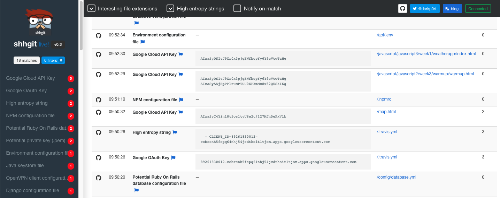

# Secret Scanning

Implementing secret scanning helps prevents you from committing passwords and other sensitive information to a git repository. This is a huge problem with people committing valuable secrets (e.g. API keys, certificates, private keys, passwords etc.) to public repos (e.g. Github). Leaking credentials in this manner can lead to the complete compromise of your service, leading to huge bills, data breaches and massive headaches as we try to piece everything back together.

This document guides you through the configuration of the [gitleaks](https://github.com/zricethezav/gitleaks) secret scanner and provides some recommended regexes for you to get started.

**Note:** There are some considerations when using a tool like this:

1. You need to configure this for every repo you have on your workstation. It is not possible to enforce the configuration of git hooks automatically on clone (otherwise an attacker could execute arbitratry code on your machine if you cloned a malicios repo), so these need to be configured per project.
2. Due to the nature of regexes, they can only capture what they are configured to capture. If you are working on a project that utilises secrets or 3rd party services that you know are not covered by the recommended regexes then please raise an issue (or a merge request) with as much information on the format of the secret as possible. The Cyber Security team will be more than happy to work with you to get these included in this project.

# Installation
Install or upgrade [gitleaks](https://github.com/zricethezav/gitleaks/releases/latest), ensure you have at least version 3.0.3 e.g.:

```
➜ gitleaks --version
3.0.3
```

## OSX
Gitleaks is available via HomeBrew on OSX.
```bash
# Install
brew install gitleaks

# Upgrade
brew upgrade gitleaks
```
## Windows
The Windows installation requires you to place the [gitleaks executable](https://github.com/zricethezav/gitleaks/releases/latest) into a folder on your path. You can use the powershell script below for installation and upgrade (you **do not** need to run Powershell as administrator for this to work):

```powershell
# Make folder to be added to path
mkdir "$HOME\bin"
# Download latest gitleaks to folder
Invoke-WebRequest https://github.com/zricethezav/gitleaks/releases/latest/download/gitleaks-windows-amd64.exe -OutFile "$HOME\bin\gitleaks.exe"
# Set path for current shell
$env:PATH += ";$HOME/bin"

# Permanently set the PATH
# Get User's current path value
$USER_PATH=[Environment]::GetEnvironmentVariable("Path", [System.EnvironmentVariableTarget]::User)
# Add folder to User's path
[Environment]::SetEnvironmentVariable("Path", $USER_PATH + ";$HOME\bin", [System.EnvironmentVariableTarget]::User)
```

# Configuration

1. Create `.gitleaks.toml` in your git repo e.g.:

    ```bash
    cd /path/to/repo
    curl https://gitlab.kainos.com/security/secret-scanning/raw/master/.gitleaks.toml -o .gitleaks.toml
    git add .gitleaks.toml
    git commit .gitleaks.toml -m "Adding .gitleaks.toml"
    ```

2. Run a full scan of your entire repo

    ```bash
    gitleaks --config=.gitleaks.toml --repo-path=. --verbose --pretty
    ```

3. Configure **pre-commit** hook to execute gitleaks automatically by creating the file `.git/hooks/pre-commit` e.g. 

    ```bash
    curl https://gitlab.kainos.com/security/secret-scanning/raw/master/pre-commit-hook.sh -o .git/hooks/pre-commit
    chmod +x .git/hooks/pre-commit
    ```

4. Test a commit e.g.:

    ```bash
    TMPFILE=$(mktemp ./XXXXXXXX)
    echo 'aws_access_key_id=AKIAZD4787KAIKLPZY77' > $TMPFILE
    git add $TMPFILE
    git commit $TMPFILE

    # Remove TMPFILE
    git rm -f $TMPFILE
    ```

5. Configure your CI pipeline to perform a secrets scan e.g. `.gitlab-ci.yml`:

    ```.yaml
    stages:
      - security

    gitleaks:
      stage: security
      image: 
        name: "zricethezav/gitleaks:v3.0.3"
        entrypoint: [""]
      script:
        - gitleaks --repo-config --repo-path=./ --verbose --pretty
    ```

# Next steps
## What to do if you find a leak?

So you've found a leak, what do you do?

1. Assuming the secret identified is a genuine data leak that has been exposed externally you should raise a [security incident](https://kainoshelp.atlassian.net/servicedesk/customer/portal/10/group/112/create/453). This will help us track how often these incidents occur and we can help you with the analysis and remediation if necessary. We will need to know the following information:

    1. Has the commit be pushed to a central repo or another developer environment?
    2. Is the repo hosted externally?
    3. Is the repo publically accessible?
    4. What secret has been leaked?
    5. When was the secret first leaked?
    6. What would an attacker have the ability to do with this secret?
    7. What steps are required to generate a new secret and replace the compromised secret?
    8. Are there any security controls in place that can mitigate the impact of the leak?

2. It is really important that the Cyber Security Capability are notified of any leak. For example, if an AWS root account access keys are leaked then we might need to detroy and recreate the entire account if there are signs of compromise. Do not underestimate how much damage can be caused by even a temporary leak of security credentials. Once they are leaked they must be considered compromised. It is not sufficient to delete the branch or project and hope nobody noticed the leak.
3. Finally, you will most likely need to follow the steps for [removing sensitive data from a repo](https://help.github.com/en/github/authenticating-to-github/removing-sensitive-data-from-a-repository). Please do not do this without providing evidence to the Cyber Security Capability first.

## False Positives
If your project is returning a false positive you can add some whitelisting regexes to individual rules e.g.:

```toml
[[Rules]]
    description = "Generic Password"
    regex = '''(?im)['"]?[a-z-_]*password[a-z-_]*['"]?\s*[=:]\s*('(?:[^'\\]|\\.){6,100}'|"(?:[^"\\]|\\.){6,100}")\s*,?\s*$'''
    tags = ["Password", "Generic"]

    [[Rules.Whitelist]]
        regex = '''passwordElement: '#password'''
        description = "ignore passwordElement"

    [[Rules.Whitelist]]
        regex = '''sessionPassword: 'secret'''
        description = "ignore dummy value for sessionPassword"
```

## Your project secrets

Have a think about the secrets in used within your project e.g.:

1. What passwords, certificates, access keys/tokens are used within your project?
2. Do you integrate with any services or APIs? How are these authenticated?
3. Do you use any public Cloud based services (e.g. AWS, Azure, OpsGenie, Slack, SendGrid etc.)?
4. Does your project use a binary file which contains secrets?

Would they be caught by this tool if you accidentally committed them to source? If not, [raise an issue](https://gitlab.kainos.com/security/secret-scanning/issues/new) so we can add a suitable regex for your secrets.

## Updates

To be notified of changes to the recommended regexes or updates to the guidance please enable notifications for this repo e.g.:


## Global config
If you prefer to use a system wide config instead of a project specific config you can use the `--config` flag to reference your config e.g.:

```bash
gitleaks --config=/path/to/.gitleaks.toml --repo-path=. --verbose --pretty
```

If you want to use this file with the `pre-commit` hook above then set the environment variable **GITLEAKS_CONFIG** with this path e.g.:

```bash
export GITLEAKS_CONFIG=/path/to/.gitleaks.toml
```

# Further Information
## Proof-of-concept

Commiting secrets to public repos is a really common and often very serious problem. For example, any commit that is pushed to GitHub is made available via their Events API. So there are tools (e.g. [shhgit](https://shhgit.darkport.co.uk/)) that just continually poll this API looking for secrets. You don't have to spend too long on this site to realise how often this occurs.



## Regexes

We have used the following sources when defining our recommended regexes. If you have anything you would like to contribute just lets us know:

1. https://github.com/awslabs/git-secrets/blob/master/git-secrets#L233
2. https://github.com/eth0izzle/shhgit/blob/master/config.yaml
3. https://github.com/dxa4481/truffleHogRegexes/blob/master/truffleHogRegexes/regexes.json
4. https://github.com/zricethezav/gitleaks/blob/master/config/default.go

A good resource for testing your regexes is [regex101.com](https://regex101.com/).
